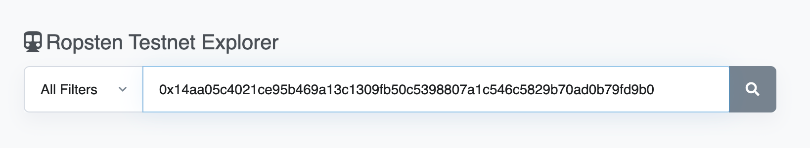
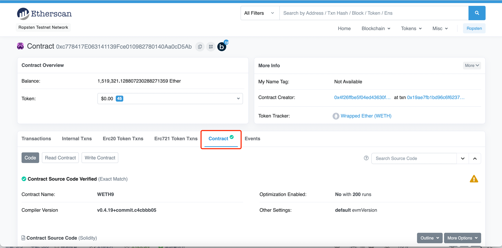

<h1 style="text-align: center;">etherscan使用介绍：</h1>

```python
Etherscan 是以太坊网络的区块链浏览器。该网站允许您搜索交易、区块、钱包地址、智能合约和其他链上数据。
它是最受欢迎的以太坊区块链浏览器之一，
并且可以免费使用。
```
>提示：
>>本次介绍仅在以太坊Testnet进行</br>
>>本次介绍的输入地址都是测试网中任意地址，仅做参考

<h2>下面介绍基本使用：</h2>
<h3>切换网络节点</h3>
<div>1.鼠标悬浮</div>


2.我们可以切换到Ropsten Testnet，Kovan Testnet，Rinkeby Testnet，Goerli Testnet ...</br>
3.选择Ropsten Testnet切换</br>


<h3>查询address</h3></br>
1.在搜索框输入查询：0x81b7E08F65Bdf5648606c89998A9CC8164397647</br>


2.可以查询到address详情</br>


<h3>查询交易</h3></br>
1.在搜索框输入查询：0x14aa05c4021ce95b469a13c1309fb50c5398807a1c546c5829b70ad0b79fd9b0</br>




2.可以查询到交易详情</br>


<h3>查询合约</h3></br>
1.在搜索框输入查询：0xc778417E063141139Fce010982780140Aa0cD5Ab</br>


2.可以查询到合约基本信息</br>


<h3>查询所有ERC20\ERC721\ERC1155合约数据</h3></br>
<div>我们以ERC20为例子来操作</div></br>
1.鼠标悬浮Tokens</br>


2.点击View ERC20 Transfers,可以查询到所有ERC20合约到交易数据</br>


<h3>查询合约ABI-json</h3></br>
1.在搜索框输入查询：0xc778417E063141139Fce010982780140Aa0cD5Ab</br>


2.进入合约详情页，点击Contract</br>



3.滚动到Contract ABI，点击复制ABI</br>


4.复制ABI后，我们可以进行导入到编译器中进行使用（这里我们使用Black IDE进行调试 https://ide.black/）</br>


注意：合约地址要是该ABI的合约地址</br>


<h3>进入合约调试页面成功</h3></br>


<h3>查询合约函数</h3></br>
1.进入合约详情页面，点击Contract->Read Contract</br>


